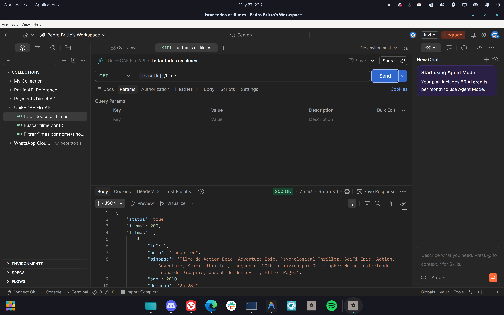
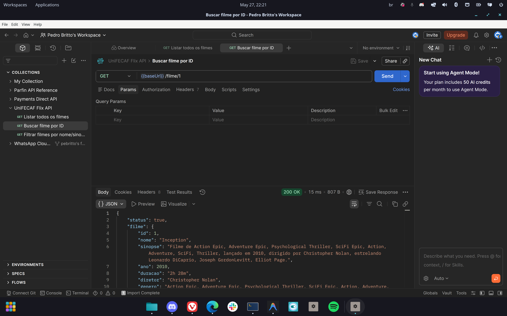
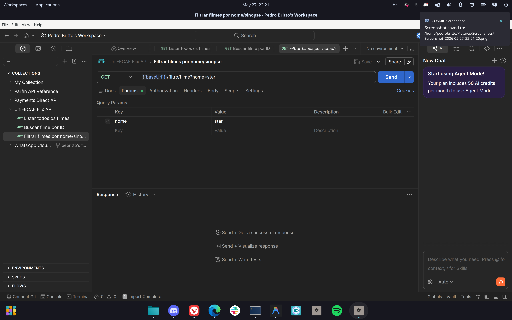
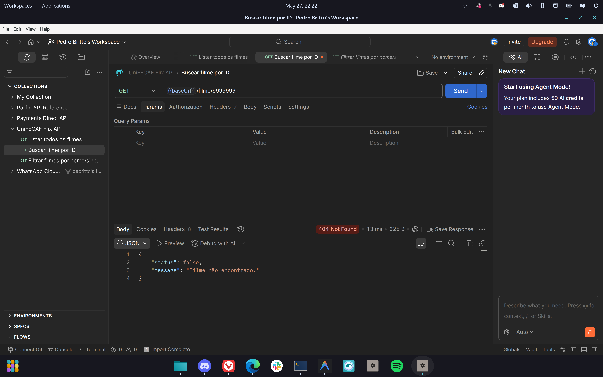
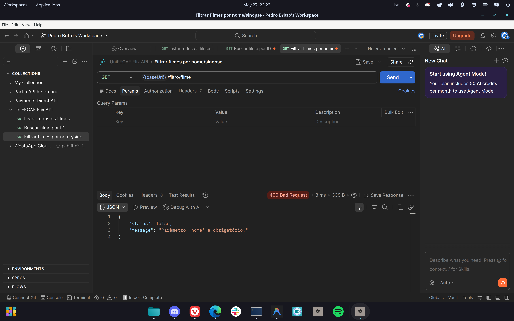
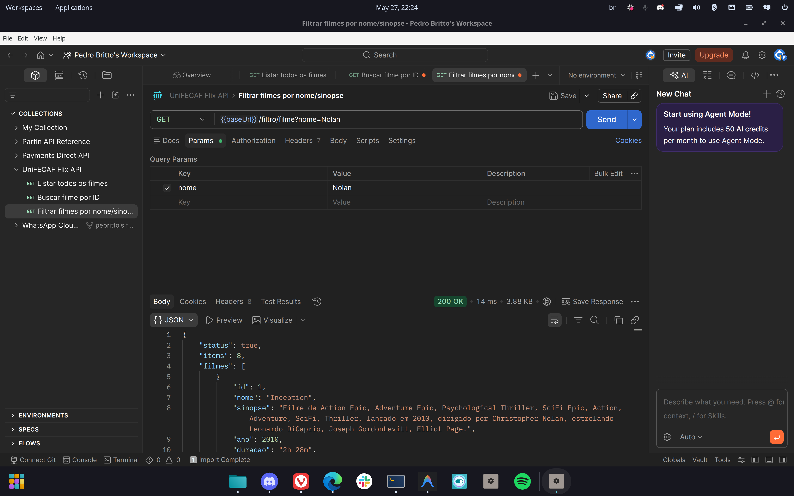

# Parte Teórica — API de Filmes UniFECAF Flix

> Documento da Parte Teórica (2,0 pts). Disciplina: Web Programming For Back End.

## 1. Arquitetura utilizada (MVC + REST)

A API segue o padrão **MVC (Model-View-Controller)**, separando responsabilidades:

- **Model** (`src/models/filmeModel.js`): camada de acesso a dados. Usa o **Prisma Client** para consultar a tabela `filme`. Não conhece `req`/`res` — só recebe parâmetros e devolve dados.
- **Controller** (`src/controllers/filmeController.js`): recebe a requisição HTTP, valida a entrada, chama o Model e monta a resposta com o **status HTTP** correto em formato JSON.
- **View**: em uma API REST não há telas HTML — a "View" é a própria **resposta JSON** devolvida ao cliente.
- **Routes** (`src/routes/filmeRoutes.js`): mapeia cada URL ao método correspondente do Controller.

Fluxo de uma requisição:

```
Cliente → Routes → Controller → Model → Prisma → MySQL
Cliente ← JSON + status HTTP ← Controller ←
```

O padrão **REST (Representational State Transfer)** organiza os recursos por URL, usa os verbos HTTP (aqui, `GET`) e comunica o resultado por **status codes** (200, 400, 404, 500). Isso torna a API previsível, fácil de integrar e de manter — qualquer cliente (web, mobile, outro serviço) consome os mesmos endpoints de forma padronizada.

## 2. Justificativa das escolhas tecnológicas

| Tecnologia | Por quê |
|---|---|
| **Node.js** | Runtime JavaScript no servidor, foco da disciplina; ecossistema NPM rico. |
| **Express** | Framework HTTP minimalista que simplifica a criação de rotas e o uso de middlewares (`cors`, `express.json()`). |
| **MySQL** | Banco de dados **relacional** exigido pelo trabalho; adequado para dados estruturados e tabulares como um catálogo de filmes. |
| **Prisma ORM** | Substitui SQL manual por uma API orientada a objetos e tipada, gera o client automaticamente, mapeia a tabela `filme` para objetos JavaScript e previne SQL Injection. |
| **Rotas versionadas** (`/v1/...`) | Boa prática REST: permite evoluir a API (v2, v3) sem quebrar quem já consome a v1. |

## 3. Endpoints

Todos sob o prefixo `/v1/controle-filmes`.

| Método | Rota | Parâmetros | Descrição |
|---|---|---|---|
| GET | `/filme` | — | Lista todos os filmes |
| GET | `/filme/:id` | `id` (path, inteiro) | Busca um filme pelo ID |
| GET | `/filtro/filme?nome=xxx` | `nome` (query string) | Filtra por parte do nome **ou** da sinopse |

**Status codes utilizados:**

- `200 OK` — requisição bem-sucedida.
- `400 Bad Request` — entrada inválida (ID não numérico, ou `nome` ausente no filtro).
- `404 Not Found` — não existe filme com o ID informado.
- `500 Internal Server Error` — erro inesperado (ex.: falha de banco).

Exemplo de resposta de sucesso (`GET /v1/controle-filmes/filme/1`):

```json
{
  "status": true,
  "filme": {
    "id": 1,
    "nome": "Inception",
    "sinopse": "Filme de Action, Adventure, SciFi, lançado em 2010, dirigido por Christopher Nolan, estrelando Leonardo DiCaprio...",
    "ano": 2010,
    "duracao": "2h 28m",
    "diretor": "Christopher Nolan",
    "genero": "Action, Adventure, SciFi",
    "elenco": "Leonardo DiCaprio, Joseph Gordon-Levitt, Elliot Page",
    "notaImdb": "8.8"
  }
}
```

Exemplo de erro (`GET /v1/controle-filmes/filme/999999`):

```json
{ "status": false, "message": "Filme não encontrado." }
```

## 4. Estrutura de pastas

```
unifecaf-flix-api/
├── prisma/
│   └── schema.prisma          # datasource MySQL + model Filme
├── src/
│   ├── models/
│   │   └── filmeModel.js       # acesso a dados via Prisma (M do MVC)
│   ├── controllers/
│   │   └── filmeController.js   # validação + status HTTP + JSON (C do MVC)
│   ├── routes/
│   │   └── filmeRoutes.js       # mapeia URLs → controller
│   ├── app.js                   # Express: cors, express.json(), monta rotas
│   └── server.js                # sobe o servidor (app.listen)
├── database/
│   └── unifecaf_flix.sql        # script SQL: CREATE TABLE + 200 INSERTs
├── postman/
│   └── unifecaf-flix.postman_collection.json
├── .env.example                 # modelo de variáveis de ambiente
└── package.json
```

Cada pasta tem uma única responsabilidade, o que facilita a manutenção e os testes: para mudar uma regra de acesso a dados mexe-se só no `models/`; para mudar uma validação ou status, só no `controllers/`.

## 5. Trechos de código

**Controller — busca por ID com validação e status HTTP** (`src/controllers/filmeController.js`):

```js
async function buscarPorId(req, res) {
  const id = Number(req.params.id);
  if (!Number.isInteger(id) || id <= 0) {
    return res.status(400).json({ status: false, message: "ID inválido." });
  }
  try {
    const filme = await filmeModel.buscarPorId(id);
    if (!filme) {
      return res.status(404).json({ status: false, message: "Filme não encontrado." });
    }
    return res.status(200).json({ status: true, filme });
  } catch (erro) {
    return res.status(500).json({ status: false, message: "Erro ao buscar filme." });
  }
}
```

**Model — filtro por nome ou sinopse usando Prisma** (`src/models/filmeModel.js`):

```js
async function filtrar(termo) {
  return prisma.filme.findMany({
    where: {
      OR: [
        { nome: { contains: termo } },
        { sinopse: { contains: termo } },
      ],
    },
    orderBy: { id: "asc" },
  });
}
```

## 6. Capturas de tela (Postman)

Testes executados no Postman com a API rodando e o banco populado (200 filmes).

### 6.1 Endpoints obrigatórios

**Listar todos os filmes** — `GET /v1/controle-filmes/filme` → `200 OK` (200 itens):



**Buscar filme por ID** — `GET /v1/controle-filmes/filme/1` → `200 OK`:



**Filtrar por nome** — `GET /v1/controle-filmes/filtro/filme?nome=star`:



### 6.2 Tratamento de erros e validações

**ID inexistente** — `GET /v1/controle-filmes/filme/9999999` → `404 Not Found`:



**ID inválido** — `GET /v1/controle-filmes/filme/abc` → `400 Bad Request`:


**Filtro sem o parâmetro `nome`** — `GET /v1/controle-filmes/filtro/filme` → `400 Bad Request`:



### 6.3 Filtro também busca na sinopse

**Filtro por `nome=Nolan`** — o termo não aparece em nenhum título, mas sim na sinopse (diretor). Retorna `200 OK` com resultados, comprovando o `OR` entre nome e sinopse:


